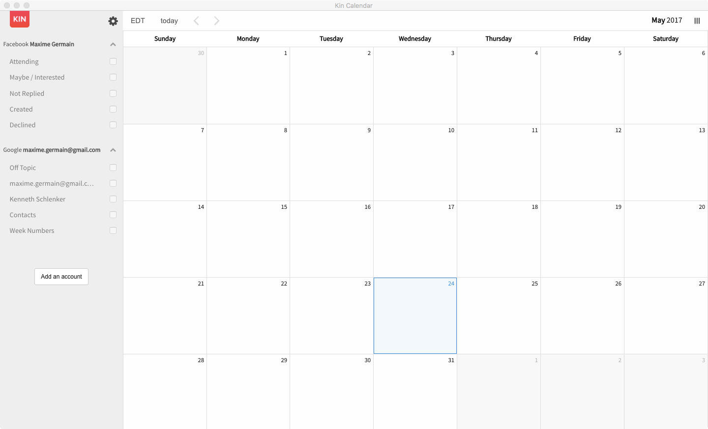

# Kin Calendar - Desktop Mac application

[Download for Mac][/mxgr/kin-calendar-desktop/raw/master/kincalendar.app.zip] - unzip and move 'Kin Calendar.app' to your application folder

This is a native wrapper for the [Kin Calendar app](https://kin.today/).

It allows you to run Kin Calendar as a desktop application on your mac.

I used [Nativefier](https://github.com/jiahaog/nativefier) to package the app, a command line tool that allows you to easily create a desktop application for any web site with succinct and minimal configuration. Apps are wrapped by [Electron](http://electron.atom.io) in an OS executable (`.app`, `.exe`, etc.) for use on Windows, macOS and Linux.

## Installation

[Download for Mac][/mxgr/kin-calendar-desktop/raw/master/kincalendar.app.zip] - unzip and move 'Kin Calendar.app' to your application folder

## License

[MIT](LICENSE.md)